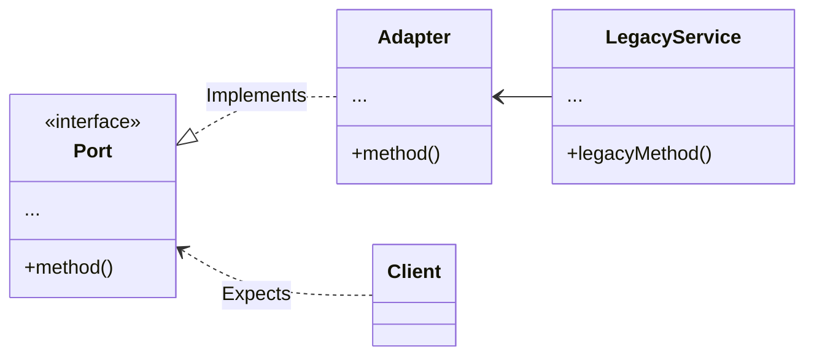

# Adapter Design Pattern

The Adapter design pattern is a structural design pattern that allows objects with incompatible interfaces to work
together. It acts as a bridge between two incompatible interfaces, converting the interface of one class into another
interface that clients expect. The Adapter pattern enables objects with different interfaces to collaborate by providing
a common interface.

In many software systems, you may encounter situations where existing classes or components have different interfaces
that cannot be directly used together. Instead of modifying the existing classes or forcing them to work together, the
Adapter pattern introduces a new class, known as the adapter, which translates the interface of one class into the
interface expected by the client code.

## Example



### Integration of Existing Components

When you need to integrate existing classes or components with different interfaces into a system, the Adapter pattern
can be used. It allows you to adapt the existing components without modifying their source code, promoting compatibility
and re-usability.

In case you want to reuse legacy code that cannot be directly used in a new system due to incompatible interfaces. By
creating adapters, you can make the legacy code work with the new system without the need for extensive modifications.

```ts
const service = (old: legacyService): ServicePort => adapter(old)
```

### Interface Conversion and Interoperability

The Adapter pattern can be used to convert or transform one interface into another. This can be beneficial when you want
to present a unified and consistent interface to clients, hiding the differences and complexities of the underlying
implementations.

If you have third-party libraries or external services that expose different interfaces, the Adapter pattern can help
you bridge the gap between your system and these external components. It enables your code to seamlessly communicate and
interact with the external interfaces.

```ts
// npm install whatever
type ThirdPartyType = (req: Request, res: Response, next: NextFunction) => void

// In our application
type HTTPContext = { req: Request, res: Response, next: NextFunction }
type MyType = (context: HTTPContext) => void // <3

// Real world would never be that simple
const adapter: MyType = (context: HTTPContext) => {
  // Implementation of thirdParty is somewhere else...
  thirdParty(context.req, context.res, context.next);
};
```

### Testing and Mocking

Adapters can also be useful in testing scenarios. By creating adapters for dependencies, you can replace real
implementations with mock or stub objects, allowing for easier unit testing or simulating different scenarios.

---

[See Go Example](../go/adapter)  
[See TypeScript Example](../typescript/src/adapter)
