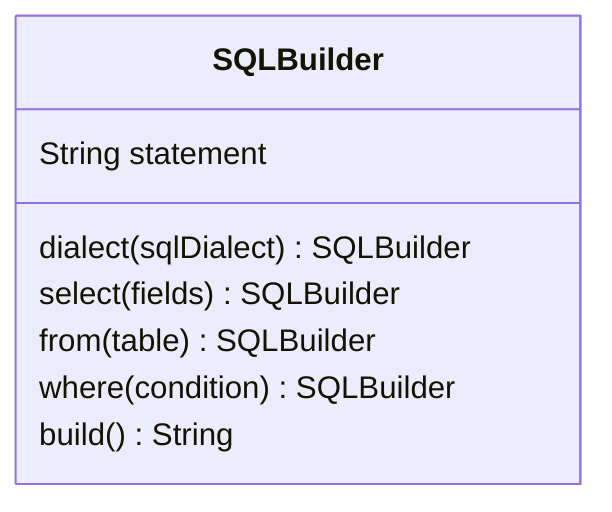

# Builder Design Pattern

**TLDR**: Builder pattern provides a flexible and organized approach to constructing complex objects. It promotes a
clear separation between the construction logic and the object itself.

The Builder design pattern os a creational design pattern that can be used to construct complex objects step by step. It
basically way to separate construction process from its representation. **Builder** allows you to construct different
variations of an object using the same construction code and prevent an unstable product to leak! *-If we create an
object with setters, object is in unstable state while setters getting called sequentially-*

The Builder pattern promotes a fluent interface or method chaining, where each method in the builder returns the builder
itself, allows more expressive and intuitive construction process most of the time.

## Example Class



## Where to use Builder Pattern

### Complex Object Construction

Builder helps to manage complexity and improves readability and maintainability of your code. It makes code more modular
and easier to reason about, as construction details are encapsulated within the builder.

```ts
const queryWraSQL = new SQLBuilder
    .dialect("postgres")
    .select("email", "age")
    .from("users")
    .where("username = wra")
    .build();
```

### Creation of Different Representations

If there are multiple optional parameters or multiple variations with
different configurations, the Builder helps you to reuse the same construction code!

```ts
// You can chain any methods that returns instance of SQLBuilder itself before calling `build()` method
// You can add any optional parameters you can!
const usePostgresDialect = new SQLBuilder.dialect("postgres")
const useMysqlDialect = new SQLBuilder.dialect("mysql")

// You can create another intermediary
const selectUsers = usePostgresDialect.select("*").from("users")

// Chain more!
// Then execute `build()` method to get sql statement.
const queryAdminsSql = selectUsers.where("role = admin").build()
const queryWraSql = selectUsers.where("username = wra").build()
```

### Immutability

By using builder pattern, you can ensure a consistent and thread-safe construction process.

### Hiding Construction Details

The builder pattern can be used to hide the construction details of an object from the client code. This can be
beneficial when the object's construction logic is complex or subject to change, allowing you to modify the construction
process without impacting the client code.

```ts
class SQLBuilder {
    // ...

    where(clause: String) {
        // Construct parameterized query
        // Hide its details from client
    }
}
```