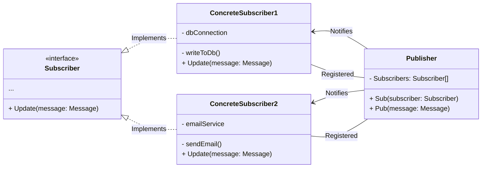

# Observer Design Pattern

The Observer design pattern is a behavioral design pattern that establishes a one-to-many relationship between objects,
such that when one object changes its state, all dependent objects are automatically notified and updated. The Observer
pattern enables loose coupling between objects, allowing for flexible and efficient communication.

In the Observer pattern, there are two main entities: the **Subject** and the **Observers**, name may vary as you
know: Publisher, Subscriber etc... The Subject is the object being observed, which maintains a list of its dependents,
known as Observers. Whenever
the Subject's state changes, it notifies all its Observers, triggering an update in each Observer.



### Decoupled Communication

When you want to establish a decoupled communication between objects, the Observer pattern is an excellent choice. It
allows the Subject and Observers to interact without having explicit knowledge of each other, promoting loose coupling
and separation of concerns.

When building systems where publishers need to distribute information to multiple subscribers, the Observer pattern can
be applied. Publishers act as Subjects, and subscribers act as Observers. This pattern facilitates scalable and
efficient message distribution.

```typescript
interface Subscriber {
  update(message) // Called when publisher publish a message
}

interface Publisher {
  subscribers: Subscriber[]

  publish(message) // Publishes message to all subscribers
}
```

### Event Handling and Notification

If you need to handle events or propagate notifications across multiple objects, the Observer pattern provides an
effective solution. It allows for event-driven architectures, where changes in one object trigger updates in other
dependent objects.

### UI Components and User Interaction

The Observer pattern is commonly used in user interface development. User interface components often observe and respond
to changes in underlying data models or user interactions. For example, when data is updated, relevant UI components can
be automatically refreshed or when a button is clicked, associated event handlers can be invoked.

```html
<input type="text" id="who">

<script>
  const who = document.getElementById("who");
  // Listens the input with id who
  who.addEventListener("keydown", (event) => {
    if (event.key === "Enter") {
      // If enter key pressed do something here
    }
  });
</script>
```

### Monitoring and logging

In monitoring systems or logging frameworks, the Observer pattern can be utilized. Observers can be registered to
receive notifications about specific events or log entries, enabling real-time monitoring or logging of system
activities.