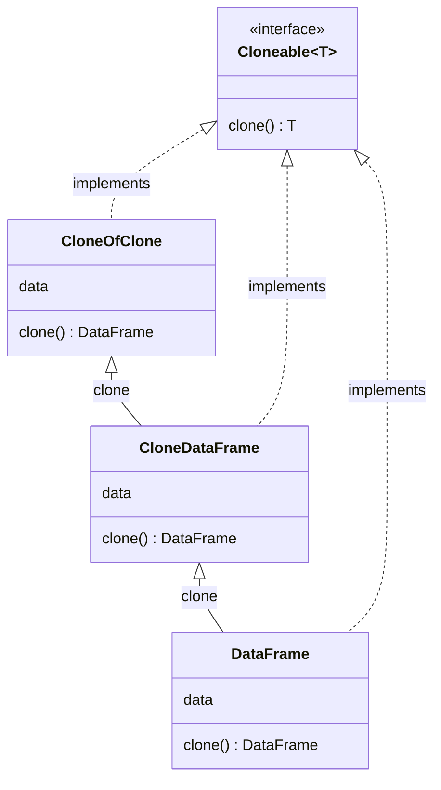

# Prototype Design Pattern

**TLDR**: The Prototype design pattern is a creational design pattern that is used to create objects by cloning or
copying
existing objects.

Instead of creating new objects through traditional instantiation, the Prototype pattern allows you to
create new objects by cloning an existing object and modifying it as needed. This approach can be useful when creating
objects is expensive or when you want to create multiple variations of an object without the need to reinitialize its
state.

In the Prototype pattern, you have a prototype object that serves as a blueprint for creating new objects. This
prototype object is typically an instance of a class that implements a cloning interface or provides a cloning method.
By cloning the prototype, you can create new objects with the same initial state as the prototype.

Prototype or Cloneable, _or whatever your naming convention suggests_ interface with a simple `clone` method to generate
deep clones of an object is a good way to
implement prototype design pattern.

## Example Schema



## Where To Use Prototype Pattern

### Object Creation is Expensive

If creating an object is resource-intensive or time-consuming, the Prototype pattern can provide a more efficient
alternative. By cloning an existing object, you can avoid the costly initialization process and achieve better
performance.

```python
df = dd.read_csv("a-big-big-file.csv")
```

### Multiple Variations of an Object

When you need to create multiple variations of an object with similar initial states, the Prototype pattern can be
useful. Instead of creating each variation from scratch, you can clone a prototype and modify the cloned object as
needed, saving time and effort.

```ts
// Somwhere in the code
const logReader = new LogReader("json", 2, "https://some-remote-something.com", 8080, "info")

const logReaderDebugLevel = logReader.clone()
logReaderDebugLevel.level = "debug"
```

### Hiding Complex Object Creation

The Prototype pattern can be used to hide the complex object creation process from the client. Instead of exposing a
complicated initialization interface, you can provide a simple cloning method, abstracting away the creation details.

```ts
import { prototype } from "logreader"

const reader = prototype.clone()
```

### Preserving Object State

The Prototype pattern allows you to create new objects while preserving the state of an existing object. This can be
particularly useful when you want to create a backup of an object or when you need to revert an object to a previous
state.

```
df = readFromCSV("some.csv")
current = df.clone()

current.merge(...).reduce(...).doStuff(...).mutate(...).cut(...)

# after a while
backup = current # if you liked it
current = df.clone()
```

### Dynamic Object Creation

If the type of objects you need to create is determined at runtime, the Prototype pattern can be used to create new
objects dynamically. By maintaining a registry of prototypes, you can clone the appropriate prototype based on runtime
conditions. It's how JavaScript works in a way...