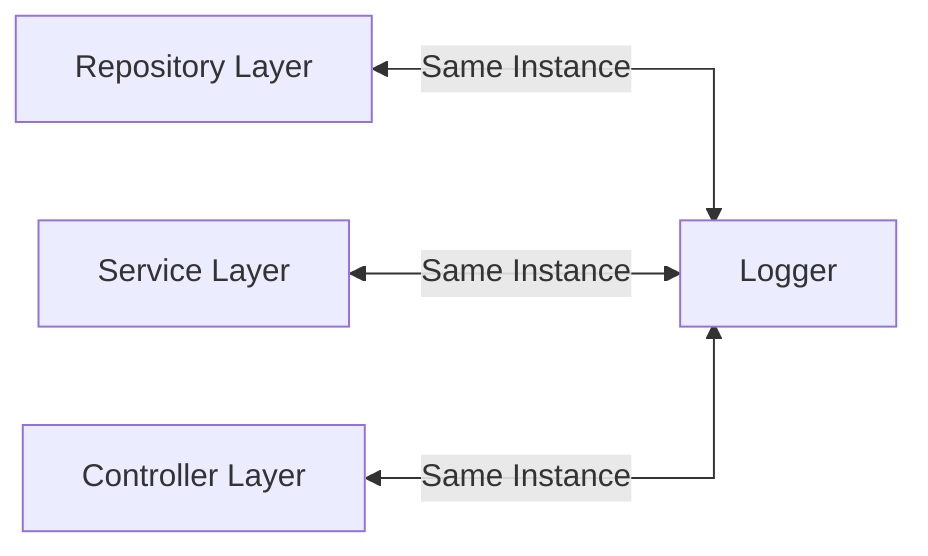

# Singleton Design Pattern

The Singleton design pattern is a creational design pattern that
**ensures the existence of only one instance of a class** throughout the application. It provides a global point of
access to this instance, allowing other objects to use it consistently. The Singleton pattern is often used when you
need a single, shared instance of a class that can be accessed from multiple parts of the application.

In the Singleton pattern, the structure itself is responsible for managing its own instance. It typically provides a
static method, property or global variable that allows other objects to retrieve the singleton instance. The first time
getter function or constructor is called, it creates the singleton object, and subsequent calls returns the same
instance.

## Where to Use the Singleton Pattern

### Global Access

When you need a global point of access to a single instance of a class, the Singleton pattern provides a convenient
solution. It ensures that all objects within the application access the same instance, facilitating data
sharing and coordination.

### Resource Management

If you have a limited resource that needs to be shared, such as a database connection, file system, or thread pool, the
Singleton pattern can be used to manage and control access to that resource. It guarantees that only stance of the
resource is created and shared across the application.

### Configuration Settings

Singleton can be used to store and access configuration settings that need to be shared and accessed from different
parts of the application. It ensures that the settings are consistent and available globally.

### Logging and Caching

Singleton can be used for centralized logging or caching mechanisms. A single instance can manage
the logging or caching operations, ensuring consistency and avoiding conflicts.